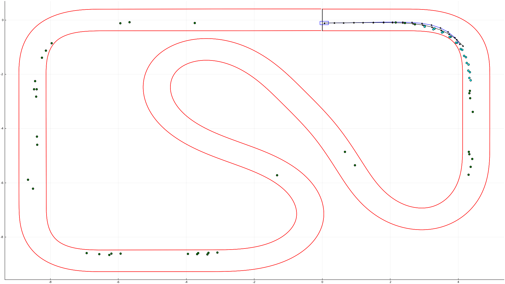
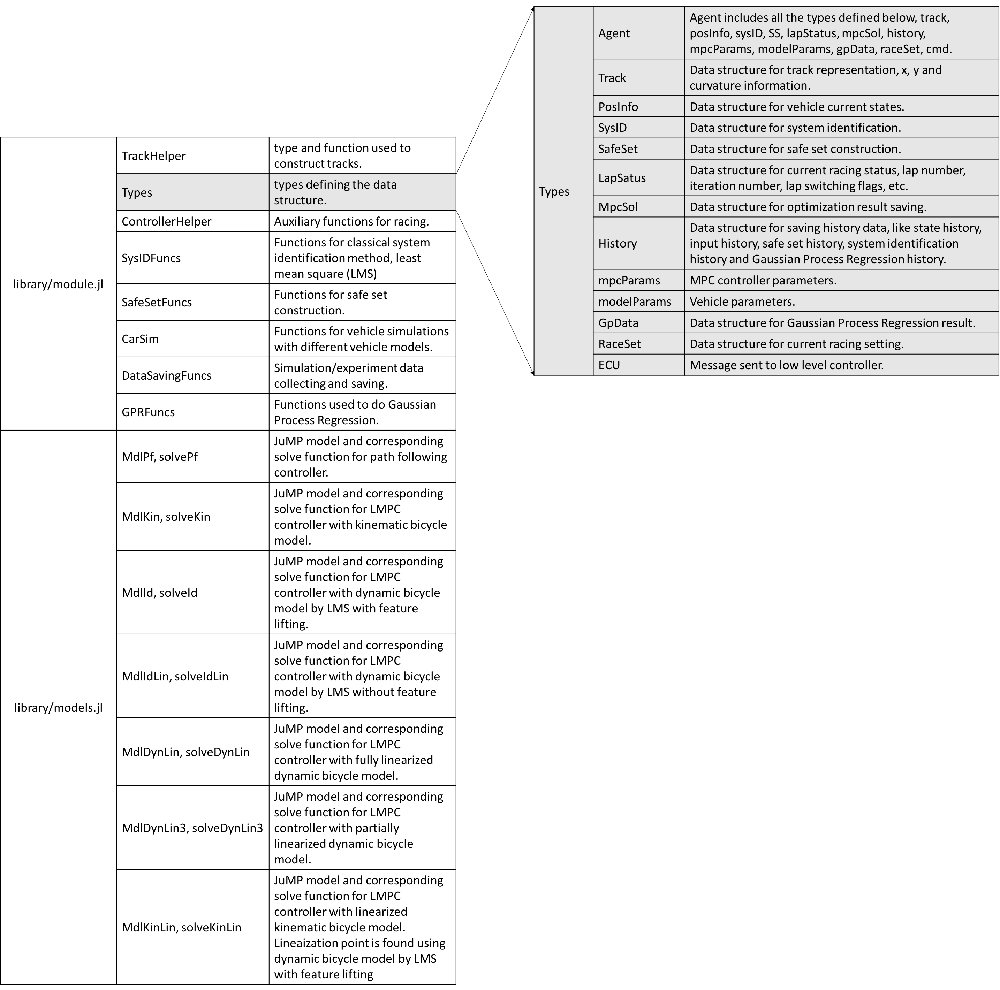

# LMPC simulation result
**Legend**:

1. Blue prediction horizon: MPC prediction.
2. Black prediction horizon: true prediction with nonlinear dynamic bicycle model used in simulator.
3. Cyan dots: safe set.
4. Green dots: feature points used to do system identification by LMS with feature lifting.

# Source code structure for LMPC
## ROS nodes
**Controller nodes**:

- `controllerOpenLoop.py`: open loop controller for hardware testing
- `controllerFd.jl`: controller used to do 8-figure to collect feature data for LMS online system identification
- `controllerDynLin.jl`: linearised dynamic bicycle model
- `controllerDynLin3.jl`: partially linearised dynamic bicycle model
- `controllerId.jl`: nonlinear dynamic bicycle model by LMS with feature lifting
- `controllerIdLin.jl`: nonlinear dynamic bicycle model by LMS
- `controllerKin.jl`: nonlinear kinematic bicycle model
- `controllerKinLin.jl`: linearised kinematic model by forecasting

**Other nodes**

- `stateEstimator.py`: Multi-rate extended Kalman filter
- `simulateDyn.py`: vehicle simulator, dynamic bicycle model
- `visualizeCar.py`: node to visualise data in real time

## Library

- `models.jl`: it includes everything for JuMP optimisation model construction and corresponding function used to solve the optimisation problem.
- `modules.jl`: modules needed for Learning MPC: 
	- Data structure types. 
	- Safe set construction.
	- Nonlinear system identification by LMS.
	- Data collecting.
	- Gaussian process regression.
- `Localization_helpers.py`: used by `stateEstimator.py` to do localisation by coordinate transformation

## Library structure and data structure

## Tools
- `trackBuilder.py`: used to do track construction to fit the experiment room.
- `estimatorPlayBack.py`: used to play back the experiment data for estimator tuning.
- `juliaPostPlot.jl`: used to plot the experiment data.
- `gpInitialTuning.jl`: used to do initial Gaussian Process Regression tuning.
- `gpFutherTuning.jl`: used to do further Gaussian Process Regression tuning based on Gaussian Process Regression experiment result.
- `copyFromBarc.bash`: copy experiment data saved on BARC.
- `copyFromLapTop.bash`: copy required code from Laptop to BARC.

